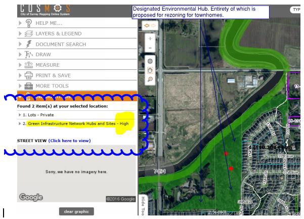
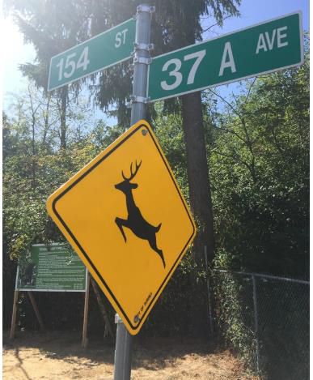
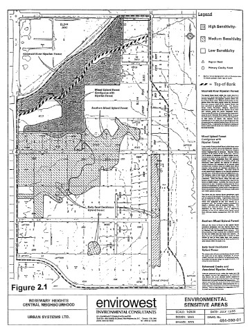

# Environmental Concerns

## Preamble/Outline

This report is prepared by the Rosemary Heights Community Association and is the product of extensive consultation with community members, archival research, and review of the various policy, scientific and ecological reports that have been prepared over the past two decades in relation to the Rosemary Heights Retreat Centre Lands. Here, we summarize concerns raised by the community about the impact of the proposed development on a protected and ecologically sensitive riparian forest. Taken together, the various concerns illustrate that the proposed development is inconsistent, and indeed in direct contravention of the City’s conservation strategy.
* Surrey’s Biodiversity Conservation Strategy is discussed in relation to the property
* Several ecological concerns are raised, including Surrey tree canopy, slope stability, and wind protection
* Surrey’s involvement in the David Suzuki Blue Dot movement
* The Rosemary Heights Neighborhood Concept Plan is discussed to show the careful planning involved in creating a well thought out community, as well as the ultimate plans for the Retreat Center Lands

## Biodiversity Conservation Strategy


The community is deeply concerned because the proposed development runs counter to the City’s own scientific research, which has identified the ecological sensitivity of the subject lands and riparian forest as a key spoke in the City’s conservation strategy, and thus worthy of protection. In fact, the Retreat Centre Lands have been identified by the Surrey Biodiversity Conservation Strategy (BCS) Green Infrastructure Network (GIN) as being a major hub (Hub J) for animal mating and migrations, including owls, eagles, deer, and many other habitat. This report ranked the Rosemary Heights wildlife corridor as **5th among all of Surrey’s Hub-to-Hub corridors in terms of ecological importance:**

>The five highest ranked hub‐to‐hub corridors are: (1) the corridor connecting the east and west portions of the Campbell Heights Northeast hub; (2) the corridor connecting the West Cloverdale North hub to the Serpentine River; (3) the corridor connecting the Upper Fergus and Lower Fergus hubs across 168 St; (4) the corridor connecting the Kensington North hub to the Campbell Heights Southwest hub across 24 Ave and 184 St; and (5)the corridor connecting the Rosemary Heights West hub to the Rosemary Heights East hub along the south bank of the Nicomekl River. All five of these corridors have an ecological significance score greater than or equal to 78.

http://www.surrey.ca/files/Surrey_EMS_Final_Repor_Consolidated__April_2011.pdf 

Page 35

The above study conducted by the City designated the subject lands as being of high ecological value and a crucial component of the hub-to-hub corridors through which animals and wildlife migrate within the Surrey ecosystem.
The City and the Rosemary Heights community (through feedback given at community meetings, forums, and council meetings in relation to the sister proposal in Barbara Creek, and elsewhere) have both identified the protection of sensitive green infrastructure hubs (large habitat areas) and sites (smaller habitat areas) as critical to preserving these dwindling natural habitat refuges, and thereby the unique character of the surrounding area.
The City’s own ecological research has pointed out that preserving a diversity of habitat features while maintaining/enhancing corridors is necessary to ensure connectivity between fragmented hubs, and for maintaining genetic variation and the health of animal populations throughout the City.

The City’s own environmental reports have pointed out that the treed canopy on the slope and floodplain plays an important role in the ecological functioning of the site and Biodiversity Conservation Strategy (BCS) corridor by providing debris, foliage and shading to the river, floodplain and the hillside slope.
Given that the City of Surrey Biodiversity Conservation Strategy has designated the subject lands as "high value", ecologically sensitive and integral for preservation of the City’s ecological diversity and wildlife corridors, the community is concerned that the proposed townhouse development, which contemplates removal of ~95% of the upland forest and intrusion upon the riparian slope, is not in keeping with the City of Surrey Biodiversity Conservation Strategy and Green Infrastructure Network Plans.



## Surrey Tree Canopy

http://www.urbansystems.ca/wp-content/uploads/2015/01/SurreyTreeCanopy_01_13_2015.pdf

A recent study conducted by Urban Systems showed that between 2001 and 2013 Surrey has lost more than 5% of its tree canopy due to development. Once a forest has been cut down it is almost impossible to restore it to its former glory. Trees play an important role in the community by providing a number of benefits. Environmentally, forests purify the air, provide a natural habitat for animals, and mitigate climate change by cooling the surrounding area. The psychological and health benefits of trees have been well researched, along with the economic benefits of having trees in a community. A change in green space can have an effect on the surrounding land value by as much as 20%.
Successful urban planning has increasingly come to recognize the importance of preserving ecologically sensitive green spaces. These lands, with their extensive 2nd growth canopy and riparian location, merit preservation under Surrey’s Conservation Strategy, and yet the proposed development makes no effort to incorporate tree and forest preservation into its design, proposing to remove 95% of the forested area.

## Slope Stability & Geotechnical Issues

Recently, four homes further down 154th Street (backing onto the existing City green space at the top of the Nicomekl bluff) settled down the slope enough that they've had their sanitary connections pull away from the City service. Their basements flooded with sanitary discharge and they had to excavate and install new connections to the City mains. This slope is steep, and this level of activity, both long term and during construction will most definitely impact that slope and the adjoining properties. The clay composition of the soil on the land poses a high risk of impacting adjacent structures and properties during construction activity.

## Trees & Wind Protection

In the most recent storm (2017MAY23) the trees in the proposed development were significantly stressed; this is not a rare event. The proposed removal of the existing forested canopy will only further stress the trees left behind to handle the wind load on their own, unshielded. This will cause significant risk to the properties backing onto the proposed development and presents a significant liability.

## Surrey Blue Dot Movement

https://www.surrey.ca/bylawsandcouncillibrary/CR_2016-R010.pdf

http://bluedot.ca/the-plan/

The "Blue Dot" movement is a grassroots effort across Canada that ultimately aims to amend the Canadian Charter of Rights and Freedoms to include the right to a healthy environment.
On January 11, 2016 the city of Surrey approved the declaration “Right to a Healthy Environment” which includes:
* Breathing clean air, drinking clean water, consuming safe food;
* Accessing nature;
* Knowing about pollutants released into the local environment; and
* Participating in government decisions that will affect the environment.

### Proposed Approach for City of Surrey

>The goals of the Blue Dot movement and the municipal Declaration represent very basic human rights to clean air, water and food and access to nature. These are important issues that are protected in Canada by federal and provincial legislation, and supported by the work of local governments including through the protection of riparian areas, reduction of greenhouse gas emissions (including from transportation), creation of parks and green spaces, and support of local food growing and healthy eating.
The principles of the Declaration are aligned with those of the Surrey Sustainability Charter, the Official Community Plan, and the Biodiversity Conservation Strategy (BCS). The Sustainability Charter vision includes that "Surrey values and protects its natural environment through stewardship of its rich tree canopy, and enhancement of its natural areas and biodiversity". Access to nature, safe food, clean air and clean water are all embodied in Sustainability Charter goals and actions across all three pillars of sustainability, including the Environmental Goal to "demonstrate good stewardship of the land, water, air and built environment, protecting, preserving, and enhancing Surrey's natural areas and ecosystems for current and future generations while making nature accessible for all to enjoy". Specific goals also exist for protecting terrestrial and aquatic habitat, preserving air quality, reducing consumption and waste, and promoting food self-sufficiency. Action items relating to air and water quality state that the City will advocate for sound practices to monitor and report on water and air quality, minimize air emissions, and encourage waste reduction.

>Further, many ideas from the Declaration can also be found in the BCS, which recognizes that preserving nature (including plants, wildlife, and ecological values and functions) provides many benefits such as clean air and water, improved health and livability, and recreational values. The BCS was developed as a shared vision for conservation and is designed to facilitate cooperation amongst citizens and leaders of
the public and private sector. It acknowledges biodiversity as a foundation for a healthy, livable, sustainable, and resilient community and offers a clear and operable strategy to preserve the natural environment while accommodating urban growth objectives.

It is the community association’s hope that council will recognize this declaration and act to preserve our neighborhoods from environmental degradation through over development.

## Neighborhood Concept Plan (NCP): Ecological Aspects

http://www.surrey.ca/files/RosemaryHeightsCentralNCP.pdf

The Community Association notes that the NCP was the result of extensive community consultation and dialogue, and resulted in the creation of a community with a unique ecological character and balance. We note that our NCP, and the process that created it, is widely regarded as a successful model for emulation, and as having achieved a high degree of livability, as evidenced by the in-migration to our community and surrounding areas. The NCP contains a carefully considered balance between different forms of land use and densities, and a carefully considered ring-road system designed around the designation of the subject lands as Institutional.
However, perhaps its greatest success is its focus on retention of ecological features such as forested areas and tree stands within the suburban community, and its retention of sight-lines onto the adjacent forest and riparian wildlife of the Retreat Centre Lands. Residents in the community purchased their properties on the basis of the NCP and with the understanding that, as a largely completed neighbourhood, the ecological integrity of the community--a core feature of its livability--would be respected and protected.

 

```
Deer crossing signs remain on 154th Street on the eastern edge of the proposed development. Seen here in the shadow of the DP sign.
The lands are home to populations of deer, eagles, coyotes, owls and other fauna that are regularly spotted in the neighbourhood. Rabbits, mice and other rodents support the local raptor population. Flocks of small and large birds regularly transit the corridor.
```

Adopted in 1996, the Rosemary Heights Neighborhood Concept Plan described with remarkable certainty, how the Rosemary Heights Retreat Centre Lands should be used in light of their ecological sensitivity. Below are several quotes from the NCP referring to the use contemplated for these lands:
* To maintain the existing Retreat Centre Institutional and allow for the development of a high school on lands which have not been identified as having environmental high sensitivity; and
* To use the Retreat Centre as an existing buffer between the Nicomekl River riparian zone and higher density residential uses proposed to the south.
* Any future expansion or renovation of the Retreat Centre site shall not impact the areas identified as having environmental high sensitivity as identified in the environmental assessment of this plan; and
* All areas designated for Institutional use have been declared development permit areas in order to regulate landscaping, siting of buildings, the form and character of buildings and protection of environment.
The broad environmental objectives of the NCP are as follows:
* To protect the environmentally sensitive areas within the neighborhood;
* To maintain the functional capacity of environmentally sensitive areas for fish and wildlife; and
* To preserve and protect the riparian forest along the Nicomekl River.

A detailed environmental assessment published by Envirowest Environmental Consultants (DRWG. No. 484-080-01) identified the retreat center lands as having a high sensitivity. Several Raptor Nests and Primary Cavity Nests were identified on the site:

 

An environmental assessment was undertaken and identified a significant riparian forest adjacent to the southern banks of the Nicomekl River. This riparian forest is identified in Figures 2.1 and 2.7 and encompasses approximately 11.5 hectares (28.41 acres) of land.
The environmental assessment classified this zone as having high environmental sensitivity. Criteria outlined in the BC Ministry of Environment Lands and Park’s “Land Development Guidelines for Protection of Aquatic Habitats” recommend that no development other than walking trails, limited community amenities and some public utilities shall be permitted within high sensitivity riparian zones.
In addition to the riparian forest, the environmental assessment identified stands of mixed upland forest contiguous with the riparian forest as having either high or medium environmental sensitivity. Property owners have identified some of these forest areas, primarily in the vicinity of 36th Avenue between the proposed ring roads, as features which should be preserved and incorporated into the open space system.

* High sensitivity areas include the riparian forest of the Nicomekl River and a portion of the mixed upland forest (coniferous and deciduous trees) which is contiguous with the riparian forest;
* Medium sensitivity areas include ephemeral creeks and their associated riparian habitats, mixed upland and early seral deciduous forest within the central and southern portions of the study area. These areas are known to accommodate raptor and active primary cavity nest sites or are used by blacktail deer.

Recommendations By Envirowest were as follows:

Nicomekl River riparian forest areas shall not be developed with uses other than walking trails, limited community amenities and some public utilities, subject to approval by the BC Ministry of Environment. Development is not to occur within that portion of the riparian forest between the natural boundary of the Nicomekl River and the top-of-bank;

Where public open space features are developed in the Nicomekl River riparian forest, and assessment of their impacts shall be undertaken by an accredited professional biologist. Impacts are to be mitigated to the fullest extent possible, with unmitigable impacts offset by compensation works that sustain the functional capacity of the forest for fish and wildlife; and, Where existing vegetation of the mixed upland forest contiguous with the riparian forest is located within the proposed linear park, it shall be retained as a special feature. Residential development adjacent to these features are encouraged to be clustered in order to retain additional trees in these areas.

The NCP document takes this even further to describe development on or near the sensitive area:

There is to be no development from the natural boundary of the Nicomekl River to the top-of-bank. Walking trails, limited community amenities (other than buildings) and some public utilities may be permitted within this area provided they do not significantly impact environmental resources. Development would be subject to approval by the BC Ministry of Environment, Lands and Parks;

* The mixed upland forest contiguous to the riparian forest may accommodate limited development. Development within these areas must sustain the functional capacity of the landscape for fish and wildlife, with special regard for raptors. Where impacts to vegetation occur, these impacts are to be offset by the planting of replacement vegetation to increase the habitat value for fish and/or wildlife;

Approximately 60% of the Retreat Center lands were designated as Institutional use and the NCP document outlines the intended purpose:

A Retreat Centre owned by the Archdiocese of Vancouver currently occupies a property fronting 152nd Street, located in the northern portion of the plan area directly south of the Nicomekl River. The environmental assessment illustrated in Figure 2.1 indicates significant areas on this property contain environmental sensitivity areas comprised of Mixed Upland Forest contiguous with the Nicomekl River riparian forest.

Those parts of the property which are not within the environmentally sensitive areas are generally already developed. The only additional development opportunity is the proposed high school located east of the existing retreat centre. The extent of the developable area is constrained by the environmentally sensitive area including the setback from the top of the bank.

The following objectives apply to the Institutional use:

* To maintain the existing Retreat Centre Institutional and allow for the development of a high school on lands which have not been identified as having environmental high sensitivity; and
* To use the Retreat Centre as an existing buffer between the Nicomekl River riparian zone and higher density residential uses proposed to the south.

The following policies and guidelines apply to the areas designated for Institutional use:

* The existing Retreat Centre site proposed for a high school shall be designated for Institutional use;
* Any future expansion or renovation of the Retreat Centre site shall not impact the areas identified as having environmental high sensitivity as identified in the environmental assessment of this plan; and all areas designated for Institutional use have been declared development permit areas in order to regulate landscaping, siting of buildings, the form and character of buildings and protection of environment.

## Conclusion / Recommendations

The Rosemary Heights Community Association supports planned and thoughtful development. The City has endeavoured to do just that (thoughtful master planning), as illustrated by the undertaking of the Rosemary Heights NCP and the Ecosystem Management Study. This said, it only works if we maintain and follow these plans. There are relatively few areas of ecological importance left in surrey, and when we develop them we don't get them back.

Porte Developments’ Retreat Center proposal as it stands should be rejected in full by council, and land designation as outlined by the Rosemary Height NCP needs to remain intact.

Council should also endeavour to use the undeveloped parkland-designated property for its intended purpose. This land is one of the last remaining natural forested habitats in the area; the Rosemary Heights/Morgan Creek area does not have any forested park area and these lands should be preserved for the benefit of all Surrey residents.