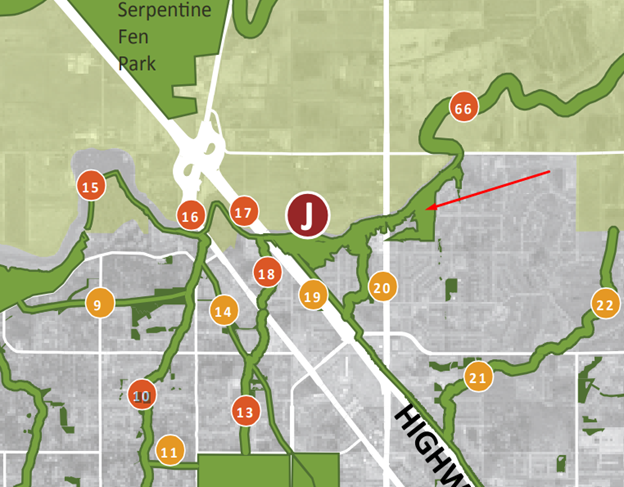

# Environmental Concerns

## Preamble/Outline

This report is prepared by the Rosemary Heights Community Association and is the product of extensive consultation with community members, archival research, and review of the various policy, scientific and ecological reports that have been prepared over the past two decades in relation to the Rosemary Heights Retreat Centre Lands. Here, we summarize concerns raised by the community about the impact of the proposed development on a protected and ecologically sensitive riparian forest. Taken together, the various concerns illustrate that the proposed development is inconsistent, and indeed in direct contravention of the City’s conservation strategy.
* Surrey’s Biodiversity Conservation Strategy is discussed in relation to the property
* Several ecological concerns are raised, including Surrey tree canopy, slope stability, and wind protection
* Surrey’s involvement in the David Suzuki Blue Dot movement
* The Rosemary Heights Neighborhood Concept Plan is discussed to show the careful planning involved in creating a well thought out community, as well as the ultimate plans for the Retreat Center Lands

## Biodiversity Conservation Strategy

The community is deeply concerned because the proposed development runs counter to the City’s own scientific research, which has identified the ecological sensitivity of the subject lands and riparian forest as a key spoke in the City’s conservation strategy, and thus worthy of protection. In fact, the Retreat Centre Lands have been identified by the Surrey Biodiversity Conservation Strategy (BCS) Green Infrastructure Network (GIN) as being a major hub (Hub J) for animal mating and migrations, including owls, eagles, deer, and many other habitat. This report ranked the Rosemary Heights wildlife corridor as **5th among all of Surrey’s Hub-to-Hub corridors in terms of ecological importance:**

The five highest ranked hub‐to‐hub corridors are: (1) the corridor connecting the east and west portions of the Campbell Heights Northeast hub; (2) the corridor connecting the West Cloverdale North hub to the Serpentine River; (3) the corridor connecting the Upper Fergus and Lower Fergus hubs across 168 St; (4) the corridor connecting the Kensington North hub to the Campbell Heights Southwest hub across 24 Ave and 184 St; and (5)the corridor connecting the Rosemary Heights West hub to the Rosemary Heights East hub along the south bank of the Nicomekl River. All five of these corridors have an ecological significance score greater than or equal to 78.

http://www.surrey.ca/files/Surrey_EMS_Final_Repor_Consolidated__April_2011.pdf

>The above study conducted by the City designated the subject lands as being of high ecological value and a crucial component of the hub-to-hub corridors through which animals and wildlife migrate within the Surrey ecosystem.
The City and the Rosemary Heights community (through feedback given at community meetings, forums, and council meetings in relation to the sister proposal in Barbara Creek, and elsewhere) have both identified the protection of sensitive green infrastructure hubs (large habitat areas) and sites (smaller habitat areas) as critical to preserving these dwindling natural habitat refuges, and thereby the unique character of the surrounding area.
The City’s own ecological research has pointed out that preserving a diversity of habitat features while maintaining/enhancing corridors is necessary to ensure connectivity between fragmented hubs, and for maintaining genetic variation and the health of animal populations throughout the City.