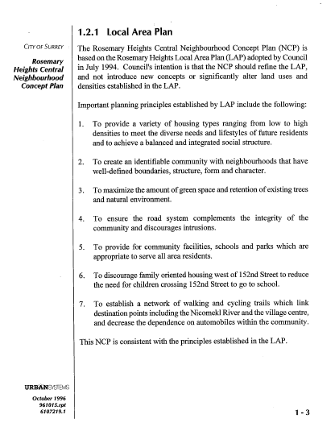

# Rosemary Heights Central Neighbourhood Concept Plan – The Concerns that Stand the Test of Time

http://www.surrey.ca/files/RosemaryHeightsCentralNCP.pdf

There are three main points that need to be addressed with regards to the proposed development for the Rosemary Heights area and retreat center lands.

In referring to the NCP page1.2.1 the important 7 principles, which are listed that correspond to the LAP are all important ideals that still apply today.

Those that apply to the retreat areas are:

* #3, to maximize the green space and retain the existing trees and natural environment;
* #4, to ensure the road system complements the integrity of the community and discourages intrusions;
* #5, to provide community facilities, schools and parks which are appropriate to serve all area residents; and
* #6, to discourage family oriented housing west of 152nd Street.

The NCP as a result of the environmental assessment, classifies this zone as having high environmental sensitivity, (p. 2-46) with a recommendation that there be **No Development within the riparian zones**. There are very clear policies stating that only walking trails, with limited community amenities and some public utilities should be constructed in this area. This is why the committee was happy with the zoning at the time.

Within the report there is a recommendation by Barbara Beblo, Senior Planner of Social Planning, that there should be a community facility built for the area. Note: this has not been accomplished but would be a potential use of the lands that would be supported by the community.
There is additional information in the NCP document that supports the retention of the riparian forest area and makes it very clear that the development of these lands is not a preferred option. It would stand to reason that after 20 years of growth, the ecological sensitivity and therefore worthiness-of-protection has only increased since the original Environmental Survey.

The applicant has repeatedly tried to argue that its proposal is consistent with the NCP, however any reasonable reading of the NCP, with its specific references to the ecological sensitivity of the lands and their protection from further development, illustrates that the applicant’s position is not supported by the evidence.

It is clear that the majority of the residents living within the NCP want the city to follow these guidelines as closely as they can and that further development be consistent with the intent and principles of the NCP when it was created. Given the hours of work and input from the residents to formulate the NCP, the residents wish to reinforce that this area has a unique quality that even city council has stated needs to be maintained. That is what the residents are fighting for.